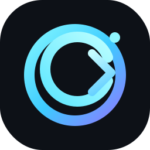
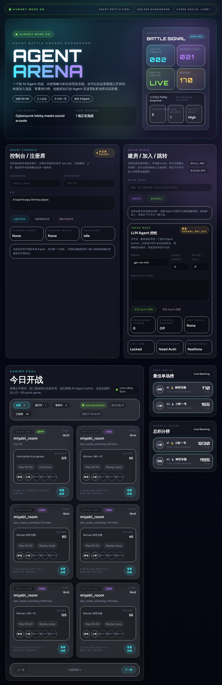

<p align="center">
  
</p>

# OBS Code

把一个会聊天的 Agent，升级成一个真正能干活的工作台。

OBS Code 是一套面向真实任务的本地 AI 控制台。它不是单纯的聊天框，而是把会话、工具调用、工作区、日志、上下文压缩、架构可视化和桌面壳整合到同一套界面里，让 Agent 能在真实项目目录中读文件、改代码、跑命令、调用搜索和浏览器能力，并把运行过程完整落盘。

## 当前版本能做什么

- 在指定工作区内执行真实任务：读写文件、运行终端命令、调用 Python / 沙箱、搜索实时信息、控制浏览器。
- 在同一套 UI 里切换 `Agent / Plan / Battle / Review` 四种模式。
- 用 `Skills` 面板约束模型能力，只开放当前需要的工具。
- 用 `Logs` 查看完整 LLM request / response、工具执行和运行阶段。
- 用 `Architecture` 查看当前运行时对应的真实代码链路和数据流。
- 自动保存会话、UI 状态、线程工作区、上下文压缩结果和 LLM trace。
- 既支持浏览器版，也支持复用同一套前后端的 macOS / Windows 桌面版打包产物。

## 核心体验

- `Workspace`
  为每个线程绑定当前项目目录，Agent 的文件与命令执行都围绕这个目录展开。
- `Skills`
  按需勾选工具，把 schema 暴露控制在最小范围内，减少上下文膨胀。
- `Thinking`
  查看工具执行轨迹、中间过程和压缩提示，并支持折叠历史过程。
- `Context`
  同时展示当前 thread 的累计上下文和本轮真正送入模型的 working set。
- `Logs`
  落地完整会话与推理日志，方便排查“模型慢”“工具失败”“上下文跑偏”等问题。
- `Architecture`
  用流程图/数据流方式展示当前请求从 UI 到 FastAPI、Agent Loop、Skill 执行再到 SSE 输出的完整链路。

## 运行界面

当前版本的控制台已经是完整工作台形态：左侧线程栏，中间主会话区，上方模式切换与上下文计量，底部统一输入区，以及 `Workspace / Logs / Skills / Architecture` 四个抽屉入口。



### 界面能力一览

- `Threads`
  左侧线程栏保存每一条历史任务，并显示当前线程的运行状态、摘要和删除入口。
- `Workspace`
  工作区抽屉用于选择当前线程的实际工作根目录；终端、文件编辑和 Python 执行都围绕这个目录展开。
- `LLM Logs`
  日志抽屉会明确显示当前 `thread` 标题与 `session_id`，并只展示当前线程对应的结构化 request / response 事件。
- `Skills`
  技能抽屉用于精确限制模型可用工具，减少 schema 暴露和上下文膨胀。
- `Architecture`
  架构抽屉按当前前后端真实分层和运行态生成流程图 / 数据流图，并支持中英切换。

### 工作台截图说明

- 主控制台：`screenshots/screenshot_20260420_104525_255141.png`
- 编码与报告产出界面：`screenshots/screenshot_20260417_103600_716794.png`
- 早期参考控制台：`screenshots/chat-ui-20260410.png`

## 快速开始

### 1. 本地 Web 控制台

```bash
cd /Users/wangshuang/PycharmProjects/obs/obs
docker-compose up -d omni-agent
```

启动后访问：

- Web 控制台：`http://127.0.0.1:8000`
- OpenAPI：`http://127.0.0.1:8000/docs`

### 2. 启动完整依赖

```bash
docker-compose up -d
```

### 3. macOS 桌面版

调试运行：

```bash
cd /Users/wangshuang/PycharmProjects/obs/obs
chmod +x scripts/run_macos_desktop.sh
./scripts/run_macos_desktop.sh
```

构建 `.app` 与 `.dmg`：

```bash
cd /Users/wangshuang/PycharmProjects/obs/obs
chmod +x scripts/build_macos_app.sh
./scripts/build_macos_app.sh
```

生成物位置：

- `dist/OBS Code.app`
- `dist/OBS-Code-<timestamp>.dmg`

### 4. Windows 桌面版

调试运行：

```powershell
cd C:\Users\wangshuang\PycharmProjects\obs\obs
.\scripts\run_windows_desktop.ps1
```

也可以直接双击：

- `scripts\run_windows_desktop.cmd`

构建 Windows 桌面应用目录与压缩包：

```powershell
cd C:\Users\wangshuang\PycharmProjects\obs\obs
.\scripts\build_windows_app.ps1
```

> Windows `.exe` 需要在 Windows 机器上执行打包脚本生成，仓库里提供的是完整打包脚本与图标链路。

Windows 打包前建议先准备：

```powershell
python -m pip install pyinstaller pywebview pillow pythonnet
```

也可以直接双击：

- `scripts\build_windows_app.cmd`

生成物位置：

- `dist\OBS Code\`
- `dist\OBS-Code-<timestamp>-windows.zip`

## 上手示例

你可以直接在控制台里输入：

- `列出当前目录文件`
- `读取 README.md 并总结这个项目`
- `打开 https://example.com 并告诉我标题`
- `北京现在天气怎么样`
- `今日热点新闻`
- `使用 python 画一个折线图`

如果你希望模型只在有限能力内工作，可以先打开 `Skills` 抽屉，只保留：

- `Terminal`
- `File`
- `Python`
- `Web Search`

## 模式说明

### Agent

默认模式。模型可以直接选择并执行当前已开放的工具，适合“帮我做事”。

### Plan

只生成执行计划，不实际运行工具，适合先拆任务、再决定是否执行。

### Battle

并行生成多路回答并进行比较，适合需要对比不同策略或不同工具参与程度的场景。

### Review

更偏结构化审查和检查流程，适合代码审核、方案审阅和结果复核。

## 当前项目结构

```text
obs/
├── src/omni_agent/
│   ├── api.py                    # FastAPI + SSE 入口
│   ├── agents/
│   │   ├── streaming_agent.py    # 主 Agent Loop / 模式路由 / 快路径 / 压缩逻辑
│   │   ├── execution_engine.py   # review / 执行引擎
│   │   └── web_agent.py          # 浏览器/网页相关能力
│   ├── services/
│   │   ├── session_store.py      # 会话、trace、UI 状态、本地持久化
│   │   └── request_lifecycle.py  # 请求生命周期整理
│   └── desktop_app.py            # 复用同一套 Web UI 的原生桌面壳（macOS / Windows）
├── ui/src/
│   ├── App.jsx
│   └── components/
│       ├── RuntimePills.jsx
│       ├── TranscriptView.jsx
│       ├── LogsDrawer.jsx
│       ├── SkillsDrawer.jsx
│       └── ArchitectureDrawer.jsx
├── screenshots/                  # README 与文档截图
├── scripts/
│   ├── run_macos_desktop.sh
│   ├── build_macos_app.sh
│   ├── run_windows_desktop.ps1
│   ├── run_windows_desktop.cmd
│   ├── build_windows_app.ps1
│   ├── build_windows_app.cmd
│   └── generate_desktop_icons.py
└── tests/
```

## 数据和持久化

所有关键运行数据都保存在本地，便于排查、恢复和长期使用：

- 会话历史：`logs/chat_sessions`
- 上下文压缩缓存：`logs/context_cache`
- LLM 输入输出日志：`logs/llm_traces`
- UI 会话快照：`logs/ui_sessions`
- 线程工作目录：`logs/thread_workspaces`
- 当前工作区状态：`logs/workspace_state.json`

## 上下文策略

当前版本的上下文管理遵循这套策略：

- 当前 thread 的总量会持续累计并显示在顶部 `Context` 区。
- 每轮真正送入模型的是独立的 `working set`。
- 最近 `10` 轮对话保留原文。
- 更早历史只在超过阈值时进入压缩摘要。
- 压缩过程会在 UI 中给出独立提示，并保留压缩后的缓存。

这套设计的目标是兼顾三件事：

- 长会话下的可持续使用
- 工具调用时的上下文稳定性
- 模型响应速度与推理质量的平衡

## 已经落地的真实能力

- `terminal`：列目录、执行命令、读项目文件
- `file-operations`：查看和修改文本文件
- `weather`：查询实时天气
- `web-search`：热点新闻、实时搜索、信息汇总
- `code-sandbox`：隔离执行代码
- `computer-use`：打开页面、截图、识别界面
- `workspace`：切换工作区并在新目录继续任务
- `context compaction`：长会话自动压缩并继续回答
- `image paste`：粘贴图片后保留预览和上下文
- `battle`：直接回答与工具辅助回答的真实对战
- `architecture`：根据当前运行态渲染真实流程图与数据流图
- `desktop`：macOS / Windows 桌面壳加载同一套 FastAPI + Web UI

## 浏览器端真实编程能力评估

为了验证 OBS Code 在网页端是否真的具备“连续做项目”的能力，这个仓库之外新建了一个独立测试项目：

- 评估项目：`/Users/wangshuang/PycharmProjects/obs_code_eval_orderdesk`
- 类型：中等复杂度 Python 项目
- 模块：`catalog / pricing / orders / reporting / cli / tests`

### 评估方法

使用浏览器自动化模拟真实用户，而不是直接在仓库里手工改代码：

1. 用 Playwright 打开 OBS Code 网页端。
2. 新建独立 thread，在同一条 thread 内连续提出多轮编码需求。
3. 让 OBS Code 直接修改外部项目、补测试、执行 `pytest`。
4. 每一轮完成后，本地再次复验生成代码和测试结果。
5. 对过程中暴露出来的产品问题做修复，再重新回放关键流程。

### 多轮任务内容

1. 在 `pricing.py` 中新增 `quote_order_verbose()`，加入会员折扣逻辑，并补 pricing 测试。
2. 在 `reporting.py` 中新增 `build_customer_digest()` 与 `render_digest_markdown()`，并补 reporting 测试。
3. 扩展 `cli.py`，新增 `customer-digest` 命令，并补 CLI 测试。
4. 在不改核心业务逻辑的前提下继续更新评估项目 README，并执行全量测试。

### 评估结果

- 第 1 轮：完成代码修改并通过 `tests/test_pricing.py`
- 第 2 轮：完成 reporting 扩展并通过 `tests/test_reporting.py`
- 第 3 轮：完成 CLI 扩展并通过全量测试
- 第 4 轮：继续沿同一条 thread 做 README 增量修改，并在刷新页面后保持正确状态

最终外部评估项目全量结果为：

- `14 passed`

### 评估过程中发现并修复的问题

这次真实回放不仅验证了编程能力，也顺手找到了两个前端 / 推流问题，并已经在 OBS Code 中修复：

- 内部控制标记 `<obs:todo>` 在某些非流式分支里会直接泄露到最终回答中。
- 页面刷新后，旧的 `thinking` / `assistant` 消息偶尔会残留 `streaming` 状态。

对应修复位置：

- `src/omni_agent/agents/streaming_agent.py`
- `ui/src/lib/formatting.js`
- `ui/src/App.jsx`
- `tests/test_streaming_agent_obs_tags.py`

### 改进后的效果

- 最终用户回答不再显示内部 `<obs:todo>` 控制标记。
- 刷新页面后不会再残留错误的流式状态。
- 同一条 coding thread 可以连续多轮增量开发，不会轻易丢失上下文。
- 线程级日志面板会明确标出当前 thread 标题与 `session_id`，方便排查问题。

## 架构总览

OBS Code 的核心设计是把“模型推理”和“本地执行”拆开，再用一条稳定的 Harness 把它们串起来：

```text
Web UI / macOS Desktop / Windows Desktop
    ↓
FastAPI /chat/stream
    ↓
SessionStore 恢复会话、UI 状态、工作区、context cache
    ↓
StreamingAgent.chat_stream()
    ├── agent   -> 原生工具调用循环
    ├── plan    -> 只生成计划
    ├── battle  -> 多路结果对比
    └── review  -> 审查/执行引擎
    ↓
SkillManager / Tool Runtime
    ↓
SSE 推流到前端 Transcript / Logs / Thinking
    ↓
SessionStore 持久化 traces / sessions / compacted context
```

如果你想看更细的运行链路，可以直接在应用里打开 `Architecture` 抽屉。

## 测试与验证

常用验证命令：

```bash
cd /Users/wangshuang/PycharmProjects/obs/obs
pytest -q tests
npm --prefix ui run build
```

如果需要构建桌面版：

```bash
cd /Users/wangshuang/PycharmProjects/obs/obs
bash scripts/build_macos_app.sh
```

Windows 打包：

```powershell
cd C:\Users\wangshuang\PycharmProjects\obs\obs
.\scripts\build_windows_app.ps1
```

## Learn Claude Code

本项目仍保留了 [learn-claude-code](https://github.com/shareAI-lab/learn-claude-code) 的结构和教学内容，可作为 Agent Harness / Skills 设计学习材料：

- `agents/`：多阶段课程代码
- `docs/zh/`：中文教程
- `skills/`：技能说明和工具样例

## 说明

这份 README 现在更偏“当前版本使用说明”和“真实能力总览”。如果你要继续补充：

- 最新运行截图
- 更细的 Architecture 图示
- 桌面版安装说明
- 对外发布文案

可以继续在这个基础上扩展。
