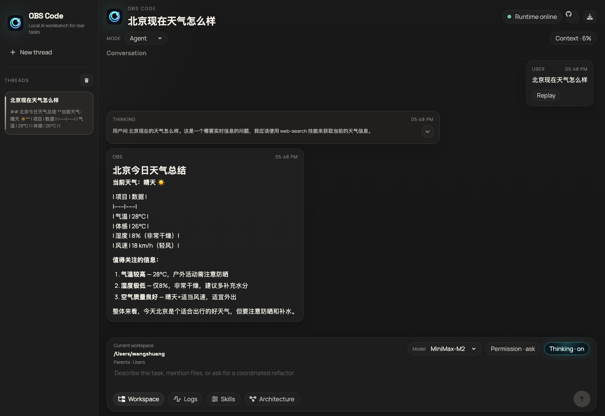

<p align="center">
  
</p>

# OBS Code

把一个会聊天的 Agent，升级成一个真正能干活的工作台。

OBS Code 不是单纯的对话框，而是一套面向真实任务的本地 AI 控制台：它能在你指定的工作区里读写文件、执行终端命令、调用 Python、搜索实时信息、控制浏览器，还会把上下文压缩、工具调用、日志和会话状态都落到本地，适合拿来做日常开发助手、研究助手、自动化助手，甚至直接作为你自己的 Claude-style 本地工作台。

## 为什么它会让人上头

- 一个界面里同时拥有聊天、技能选择、日志面板、工作区切换、上下文压缩和本地持久化。
- 按技能暴露工具，不把所有 schema 一股脑塞给模型，尽量减少上下文膨胀。
- 对话不是“只会说”，而是能在当前工作区里真的执行文件、终端、Python 和浏览器相关操作。
- 每轮 LLM 输入输出、会话历史、上下文摘要都会落到本地，方便追踪和排查。
- 支持 Docker 开发、Web 控制台和 macOS 原生桌面打包。

## 你能拿它做什么

- 让 Agent 在指定项目目录下读代码、改代码、跑命令、生成脚本。
- 把搜索、天气、新闻这类实时信息接成 skill，像插件一样开关。
- 用浏览器/Computer Use 能力自动打开页面、截图、点击、输入。
- 用 Python 或代码沙箱生成图表、处理数据、做实验。
- 保存长会话并自动压缩上下文，不必每次重头解释项目背景。

## 核心能力

- `Workspace` 工作区切换：为每个会话指定当前项目根目录。
- `Skills` 技能筛选：只让模型使用你允许的能力。
- `Logs` 本地日志：持久化完整 LLM request / response，支持时间筛选。
- `Thinking` 折叠块：可查看中间推理与工具过程。
- `Context compaction`：长对话自动在发送前压缩成模型可继续使用的摘要。
- `Image paste`：聊天框支持粘贴图片、顺序占位和悬停预览。

## 运行效果

当前界面已经是完整可交互的 Claude-style 控制台，包括会话侧栏、Thinking 折叠块、工作区抽屉、日志抽屉和技能筛选：



## 快速开始

### 1. 本地开发

```bash
cd /Users/wangshuang/PycharmProjects/obs/obs
docker-compose up -d omni-agent
```

启动后访问：

- Web 控制台: `http://127.0.0.1:8000`
- OpenAPI: `http://127.0.0.1:8000/docs`

### 2. Docker 整体启动

```bash
docker-compose up -d
```

### 3. macOS 原生桌面版

调试运行：

```bash
cd /Users/wangshuang/PycharmProjects/obs/obs
chmod +x scripts/run_macos_desktop.sh
./scripts/run_macos_desktop.sh
```

构建 `.app` 与 `.dmg`：

```bash
cd /Users/wangshuang/PycharmProjects/obs/obs
chmod +x scripts/build_macos_app.sh
./scripts/build_macos_app.sh
```

生成物位置：

- `dist/OBS Code.app`
- `dist/OBS-Code-<timestamp>.dmg`

## 上手体验

打开控制台后，你可以直接这样用：

- `列出当前目录文件`
- `读取 README.md 并总结这个项目`
- `打开 https://example.com 并告诉我标题`
- `北京现在天气怎么样`
- `今日热点新闻`
- `使用 python 画一个折线图`

如果你希望模型只在某个能力范围内工作，可以先打开 `Skills` 抽屉，只保留：

- `Terminal`
- `File`
- `Python`
- `Web Search`

## 数据和持久化

所有关键运行数据都保存在本地，便于排查、恢复和长期使用：

- 会话历史：`logs/chat_sessions`
- 上下文压缩缓存：`logs/context_cache`
- LLM 输入输出日志：`logs/llm_traces`
- 线程工作目录：`logs/thread_workspaces`
- 当前工作区状态：`logs/workspace_state.json`

## 已验证的真实能力

当前版本已经做过真实多轮回归测试，覆盖：

- `terminal`：列目录、执行命令
- `file-operations`：读取 README、查看文件
- `weather`：北京实时天气
- `web-search`：今日热点新闻
- `code-sandbox`：Python 计算与执行
- `computer-use`：打开网页并识别页面标题
- `workspace`：切换工作区后在新目录执行命令
- `context compaction`：长会话自动压缩并继续回答
- `image paste`：粘贴图片后可做本地视觉兜底分析

## Learn Claude Code

本项目仍保留了 [learn-claude-code](https://github.com/shareAI-lab/learn-claude-code) 的结构与教学内容，可作为 Agent Harness / Skills 设计学习材料：

- `agents/`: 多阶段课程代码
- `docs/zh/`: 中文教程
- `skills/`: 技能说明和工具样例

## 🏗️ 架构设计

### Claude Skills三级架构

项目严格按照Claude官方Skills架构设计：

```
.claude/skills/
├── computer-use/           # 计算机视觉操作技能
│   ├── SKILL.md           # Level 1: 元数据 + Level 2: 指令
│   ├── computer_use.py    # Level 3: Python实现
│   └── examples/          # 使用示例
├── file-operations/        # 文件操作技能  
│   ├── SKILL.md
│   ├── text_editor.py
│   └── examples/
└── terminal/              # 终端执行技能
    ├── SKILL.md
    ├── bash.py
    └── examples/
```

#### Level 1: 元数据 (始终加载)
```yaml
---
name: computer-use
description: Use mouse and keyboard to interact with computer
---
```

#### Level 2: 指令 (触发时加载)
```markdown
# Computer Use Skill

使用此技能通过视觉界面与计算机交互...

## Quick Start
## Available Actions  
## Workflows
## Best Practices
```

#### Level 3: 代码 (按需加载)
```python
class ComputerUseSkill(BaseSkill):
    async def execute(self, **kwargs):
        # 具体实现逻辑
        pass
```

## 🔧 技能详解

### 1. 计算机视觉技能 (computer-use)

**功能**: 屏幕截图、鼠标键盘操作、网页浏览

**可用操作**:
- `screenshot` - 截取屏幕
- `left_click` - 左键点击
- `right_click` - 右键点击  
- `type` - 文字输入
- `key` - 特殊按键

**示例**:
```python
# 截图查看当前状态
result = await execute_skill("computer", action="screenshot")

# 点击指定坐标
result = await execute_skill("computer", 
    action="left_click", 
    coordinate=[100, 200]
)
```

### 2. 文件操作技能 (file-operations)

**功能**: 文本文件的查看、创建、编辑、管理

**支持格式**: `.py`, `.js`, `.html`, `.json`, `.md`, `.txt` 等

**可用命令**:
- `view` - 查看文件内容
- `create` - 创建新文件
- `str_replace` - 字符串替换
- `insert` - 插入文本
- `undo_edit` - 撤销编辑

**示例**:
```python
# 查看文件
result = await execute_skill("str_replace_editor",
    command="view",
    path="src/main.py"
)

# 创建文件
result = await execute_skill("str_replace_editor",
    command="create", 
    path="test.py",
    file_text="print('Hello World')"
)
```

### 3. 终端执行技能 (terminal)

**功能**: 安全的命令行操作，支持多种开发工具

**允许的命令类型**:
- 文件操作: `ls`, `cat`, `mkdir`, `cp`, `mv`
- 开发工具: `python`, `node`, `git`, `npm`, `pip`
- 系统工具: `curl`, `wget`, `ps`, `top`

**安全机制**:
- 命令白名单验证
- 危险操作拦截
- 超时保护
- 工作目录隔离

**示例**:
```python
# 执行Python脚本
result = await execute_skill("bash",
    command="python script.py",
    timeout=30
)

# Git操作
result = await execute_skill("bash",
    command="git status"
)
```

## 🛠️ 开发指南

### 添加新技能

1. **创建技能目录**:
```bash
mkdir .claude/skills/my-skill
```

2. **编写SKILL.md**:
```yaml
---
name: my-skill
description: My custom skill description
---

# My Skill

详细说明和使用指南...
```

3. **实现Python类**:
```python
class MySkill(BaseSkill):
    def __init__(self):
        super().__init__(
            name="my-skill",
            description="My skill description"
        )
    
    async def execute(self, **kwargs):
        # 实现逻辑
        return SkillResult(success=True, content="结果")
```

### 配置环境变量

创建 `.env` 文件：
```bash
# VLLM多模态模型配置
VLLM_BASE_URL=http://223.109.239.14:10002/v1/chat/completions
VLLM_API_KEY=your_api_key
VLLM_MODEL=multimodal_model

# 工作目录
WORK_DIR=./workspace

# 功能开关
ENABLE_COMPUTER_USE=true
ENABLE_TEXT_EDITOR=true  
ENABLE_BASH=true

# 日志配置
LOG_LEVEL=INFO
LOG_FILE=./logs/omni_agent.log
```

## 🐳 Docker部署

### 开发模式 (极速重载)
```bash
# 0.05秒内检测代码变更并重启
docker-compose -f docker-compose.dev.yml up -d
```

### 生产模式  
```bash
# 稳定运行，适合生产环境
docker-compose up -d
```

### 容器管理
```bash
# 查看日志
docker-compose logs -f omni-agent

# 重启服务  
docker-compose restart

# 停止服务
docker-compose down
```

## 📋 API接口

### 核心端点

| 端点 | 方法 | 描述 |
|------|------|------|
| `/health` | GET | 健康检查 |
| `/skills` | GET | 获取技能列表 |  
| `/execute` | POST | 执行技能 |
| `/` | GET | Web前端界面 |

### 执行技能
```bash
curl -X POST http://localhost:8000/execute \
  -H "Content-Type: application/json" \
  -d '{
    "tool_name": "computer",
    "parameters": {
      "action": "screenshot"
    }
  }'
```

## 🔒 安全机制

- **命令白名单** - 只允许安全的系统命令
- **路径验证** - 文件操作限制在工作目录内
- **超时保护** - 防止命令无限执行
- **权限隔离** - 容器化运行环境
- **输入验证** - 严格的参数检查

## 🐛 故障排除

### 常见问题

**1. 服务启动失败**
```bash
# 检查端口占用
netstat -an | findstr 8000

# 查看详细日志
docker-compose logs -f omni-agent
```

**2. 技能加载失败**
```bash
# 检查.claude/skills目录结构
ls -la .claude/skills/

# 验证SKILL.md格式
```

**3. Docker构建失败**
```bash
# 使用Docker模式
docker-compose up -d

# 或配置Docker镜像加速器
docker_setup.bat
```

**4. 前端访问问题**
```bash
# 确认服务运行状态
curl http://127.0.0.1:8000/health

# 检查防火墙设置
```

## 🎯 路线图

- [ ] 集成VLLM多模态推理
- [ ] 支持更多文件格式
- [ ] 增强网页爬虫能力
- [ ] 添加数据库操作技能
- [ ] 支持插件市场
- [ ] 移动端适配
- [ ] 多用户支持

## 📄 许可证

MIT License - 详见 [LICENSE](LICENSE) 文件

## 🤝 贡献

欢迎提交Issue和Pull Request！

1. Fork 项目
2. 创建功能分支
3. 提交更改  
4. 推送到分支
5. 创建Pull Request

## 📞 支持

- 📧 邮箱: support@omni-agent.com
- 💬 问题反馈: [GitHub Issues](https://github.com/your-repo/omni-agent/issues)
- 📚 文档: [在线文档](https://docs.omni-agent.com)

---

⭐ 如果这个项目对你有帮助，请给个Star！

**Made with ❤️ by Omni Agent Team**
