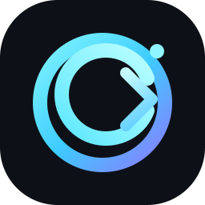
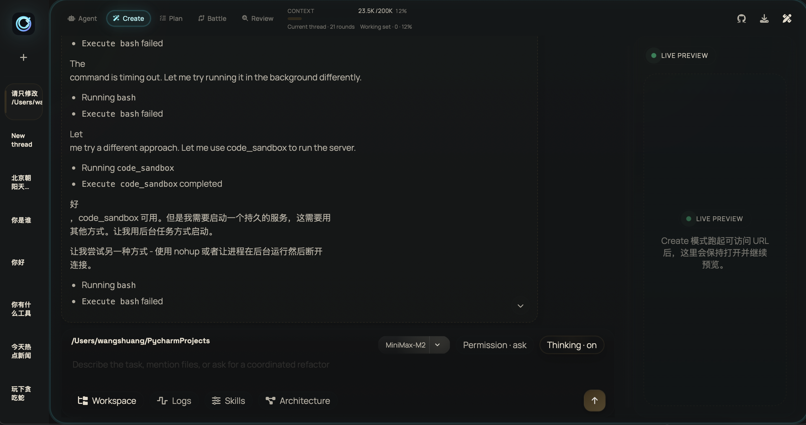
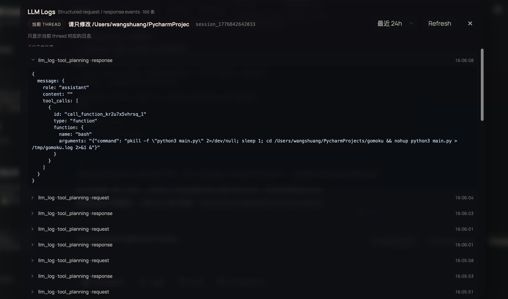
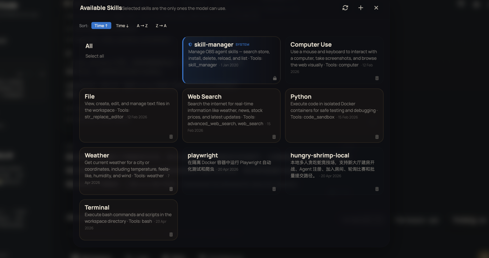
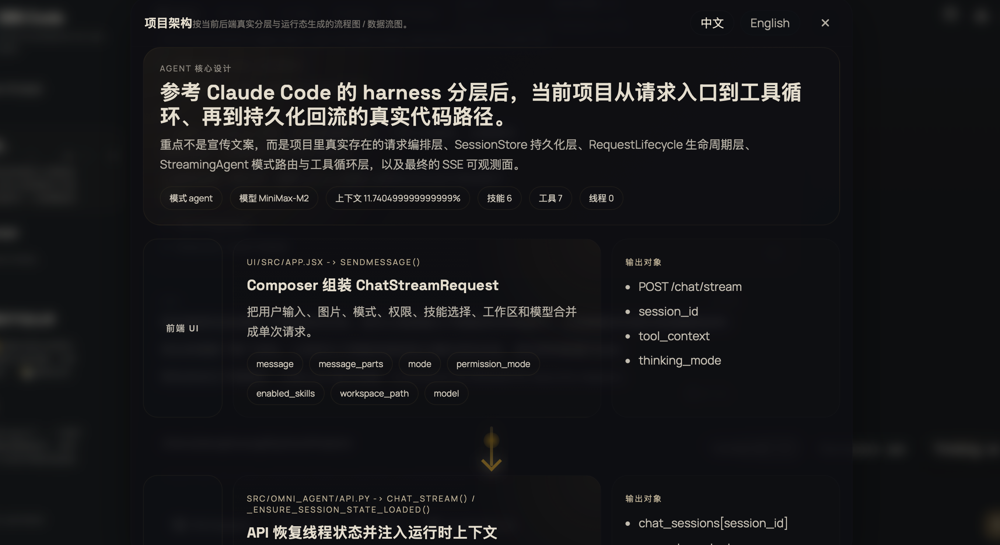

<p align="center">
  
</p>

# OBS Code

把一个会聊天的 Agent，升级成一个真正能干活的工作台。

OBS Code 是一套面向真实任务的本地 AI 控制台。它不是单纯的聊天框，而是把会话、工具调用、工作区、日志、上下文压缩、架构可视化和桌面壳整合到同一套界面里，让 Agent 能在真实项目目录中读文件、改代码、跑命令、调用搜索和浏览器能力，并把运行过程完整落盘。

## 当前版本能做什么

- 在指定工作区内执行真实任务：读写文件、运行终端命令、调用受控搜索能力、控制浏览器并采集验证证据。
- 在同一套 UI 里切换 `Agent / Plan / Battle / Review` 四种模式。
- 用 `Skills` 面板约束模型能力，只开放当前需要的工具。
- 用 `Logs` 查看完整 LLM request / response、工具执行和运行阶段。
- 用 `Architecture` 查看当前运行时对应的真实代码链路和数据流。
- 自动保存会话、UI 状态、线程工作区、上下文压缩结果和 LLM trace。
- 既支持浏览器版，也支持复用同一套前后端的 macOS / Windows 桌面版打包产物。

## 核心体验

- `Workspace`
  为每个线程绑定当前项目目录，Agent 的文件与命令执行都围绕这个目录展开。
- `Skills`
  按需勾选工具，把 schema 暴露控制在最小范围内，减少上下文膨胀。
- `Thinking`
  查看工具执行轨迹、中间过程和压缩提示，并支持折叠历史过程。
- `Context`
  同时展示当前 thread 的累计上下文和本轮真正送入模型的 working set。
- `Logs`
  落地完整会话与推理日志，方便排查“模型慢”“工具失败”“上下文跑偏”等问题。
- `Architecture`
  用流程图/数据流方式展示当前请求从 UI 到 FastAPI、Agent Loop、Skill 执行再到 SSE 输出的完整链路。

## 运行界面

当前版本的控制台已经是完整工作台形态：左侧线程栏，中间主会话区，上方模式切换与上下文计量，底部统一输入区，以及 `Workspace / Logs / Skills / Architecture` 四个抽屉入口。



### 界面能力一览

- `Threads`
  左侧线程栏保存每一条历史任务，并显示当前线程的运行状态、摘要和删除入口。
- `Workspace`
  工作区抽屉用于选择当前线程的实际工作根目录；终端、文件编辑和 Python 执行都围绕这个目录展开。
- `LLM Logs`
  日志抽屉会明确显示当前 `thread` 标题与 `session_id`，并只展示当前线程对应的结构化 request / response 事件。
- `Skills`
  技能抽屉用于精确限制模型可用工具，减少 schema 暴露和上下文膨胀。
- `Architecture`
  架构抽屉按当前前后端真实分层和运行态生成流程图 / 数据流图，并支持中英切换。

### 工作台截图说明

下面这组截图都来自当前版本的真实运行界面，统一放在 `assets/` 目录：

- 主工作台（Create 模式 + Live Preview）：`assets/Snipaste_2026-04-24_16-55-25.png`
- 日志面板（当前 thread 的结构化 LLM logs）：`assets/Snipaste_2026-04-24_17-35-11.png`
- Skills 面板（按需开放工具）：`assets/Snipaste_2026-04-24_17-37-12.png`
- Architecture 面板（真实请求链路与数据流）：`assets/Snipaste_2026-04-24_17-37-23.png`

#### Logs



#### Skills



#### Architecture



## 快速开始

### 1. 本地 Web 控制台

推荐用仓库脚本同时启动前后端：

```bash
cd /Users/wangshuang/PycharmProjects/obs/obs
./run.sh start
```

后端入口是 `api:app`，前端入口是 `ui/` 下的 Vite dev server。

如需直接运行后端：

```bash
cd /Users/wangshuang/PycharmProjects/obs/obs
PYTHONPATH=src uv run uvicorn api:app --host 0.0.0.0 --port 8000
```

PyCharm 调试后端时，右键运行：

- `scripts/pycharm_debug_backend.py`

这个脚本会自动启动前端，并在当前 Python 进程中运行后端，方便断点直接进入 endpoint 和 Harness 代码。

Docker 运行：

```bash
cd /Users/wangshuang/PycharmProjects/obs/obs
docker-compose up -d obs-code
```

启动后访问：

- Web 控制台：`http://127.0.0.1:8000`
- OpenAPI：`http://127.0.0.1:8000/docs`

### 2. 启动完整依赖

```bash
docker-compose up -d
```

### 3. macOS 桌面版

调试运行：

```bash
cd /Users/wangshuang/PycharmProjects/obs/obs
chmod +x scripts/run_macos_desktop.sh
./scripts/run_macos_desktop.sh
```

构建 `.app` 与 `.dmg`：

```bash
cd /Users/wangshuang/PycharmProjects/obs/obs
chmod +x scripts/build_macos_app.sh
./scripts/build_macos_app.sh
```

生成物位置：

- `dist/OBS Code.app`
- `dist/OBS-Code-<timestamp>.dmg`

### 4. Windows 桌面版

调试运行：

```powershell
cd C:\Users\wangshuang\PycharmProjects\obs\obs
.\scripts\run_windows_desktop.ps1
```

也可以直接双击：

- `scripts\run_windows_desktop.cmd`

构建 Windows 桌面应用目录与压缩包：

```powershell
cd C:\Users\wangshuang\PycharmProjects\obs\obs
.\scripts\build_windows_app.ps1
```

> Windows `.exe` 需要在 Windows 机器上执行打包脚本生成，仓库里提供的是完整打包脚本与图标链路。

Windows 打包前建议先准备：

```powershell
python -m pip install pyinstaller pywebview pillow pythonnet
```

也可以直接双击：

- `scripts\build_windows_app.cmd`

生成物位置：

- `dist\OBS Code\`
- `dist\OBS-Code-<timestamp>-windows.zip`

## 上手示例

你可以直接在控制台里输入：

- `列出当前目录文件`
- `读取 README.md 并总结这个项目`
- `打开 https://example.com 并告诉我标题`
- `北京现在天气怎么样`
- `今日热点新闻`
- `使用 python 画一个折线图`

如果你希望模型只在有限能力内工作，可以先打开 `Skills` 抽屉，只保留当前任务真正需要的技能，例如：

- `desktop-commander`
- `file-manager`
- `computer-use`
- `web-search-free`

## 模式说明

顶部的 mode pills 不只是视觉切换，它们会直接改变 Agent 的工作方式、工具使用策略和输出风格。当前版本支持四种模式：

### Agent

默认模式，也是最接近“直接交给 Agent 开工”的模式。

- 会直接调用当前已开放的工具
- 适合读代码、改文件、跑命令、查信息、连续执行任务
- 更强调结果导向和端到端完成

典型场景：

- `帮我修一下这个接口报错`
- `把 README 更新成当前版本`
- `打开这个页面看看为什么不对`

### Plan

偏“先想清楚再动手”的模式。

- 主要输出任务拆解、实现顺序、风险点和执行建议
- 默认不直接跑工具，适合先梳理方案
- 对复杂需求、重构、跨模块修改更有帮助

典型场景：

- `先帮我规划一下这个功能怎么拆`
- `这个项目如果要重构，给我一个分步骤方案`
- `先不要改代码，先列计划`

### Battle

偏“多路思考和对比”的模式。

- 会生成多种候选思路或回答，再做比较
- 适合需要权衡方案、比较风格、选择路线的时候使用
- 对开放性问题、策略选择题、提示词对比这类任务比较有效

典型场景：

- `给我两个不同的实现方向，比较一下`
- `这个需求用规则系统还是 Agent 流程更合适`
- `同一个问题给我几种方案再推荐`

### Review

偏“检查、审阅、找问题”的模式。

- 更强调结构化审查、风险识别和结果复核
- 适合代码 review、方案 review、结果验收
- 输出会更聚焦问题、遗漏和改进建议

典型场景：

- `review 一下这次改动有没有风险`
- `检查这个实现有没有遗漏测试`
- `帮我复核这份结果是否靠谱`

### 模式选择建议

- 想直接干活：`Agent`
- 想先拆任务：`Plan`
- 想比较不同路线：`Battle`
- 想做审查和复核：`Review`

当前界面会按 thread 记住你上次选择的 mode，刷新页面后也会恢复到对应状态。

## 当前项目结构

```text
obs/
├── assets/                       # Logo 与当前版本 README 截图
├── src/
│   ├── api.py                    # FastAPI + /chat/stream SSE 入口
│   ├── main.py                   # Typer CLI / uvicorn 开发入口
│   ├── desktop_app.py            # 复用同一套 Web UI 的桌面壳
│   ├── agents/
│   │   ├── harness_runtime.py    # Harness 主状态机与五角色编排
│   │   ├── harness_engine.py     # 合约、权限、Search Gate、决策和策略校验
│   │   ├── planner_agent.py      # 生成 PlanContract
│   │   ├── search_agent.py       # 受控外部检索
│   │   ├── generator_agent.py    # 受限文件生成/修改
│   │   ├── runner_agent.py       # 命令、dev server、浏览器 smoke 证据采集
│   │   ├── evaluator_agent.py    # PASS / 修复 / 重规划 / 搜索判定
│   │   ├── plan_agent.py         # 旧 UI 规划兼容能力
│   │   ├── execution_engine.py   # review / 执行引擎
│   │   └── web_agent.py          # 浏览器/网页相关能力
│   ├── config/
│   │   └── config.py             # 环境变量、路径与模型配置
│   ├── core/
│   │   ├── agent.py              # OBSAgent 主调度器
│   │   ├── vllm_client.py        # 文本/视觉/思考模型客户端
│   │   └── logger.py             # 日志初始化与 live logging
│   ├── services/
│   │   ├── session_store.py      # 会话、trace、UI 状态、本地持久化
│   │   └── request_lifecycle.py  # 请求生命周期整理
│   ├── skills/                   # 当前唯一生效的运行时技能根目录（src/skills）
│   └── utils/
│       └── paths.py              # 源码/打包环境下的资源路径解析
├── ui/src/
│   ├── App.jsx
│   └── components/
│       ├── RuntimePills.jsx
│       ├── TranscriptView.jsx
│       ├── LogsDrawer.jsx
│       ├── SkillsDrawer.jsx
│       └── ArchitectureDrawer.jsx
├── screenshots/                  # 历史截图与文档留档
├── scripts/
│   ├── run_macos_desktop.sh
│   ├── build_macos_app.sh
│   ├── run_windows_desktop.ps1
│   ├── run_windows_desktop.cmd
│   ├── build_windows_app.ps1
│   ├── build_windows_app.cmd
│   └── generate_desktop_icons.py
└── tests/
```

## 数据和持久化

所有关键运行数据都保存在本地，便于排查、恢复和长期使用：

- 会话历史：`logs/chat_sessions`
- 上下文压缩缓存：`logs/context_cache`
- LLM 输入输出日志：`logs/llm_traces`
- UI 会话快照：`logs/ui_sessions`
- 线程工作目录：`logs/thread_workspaces`
- 当前工作区状态：`logs/workspace_state.json`

## 上下文策略

当前版本的上下文管理遵循这套策略：

- 当前 thread 的总量会持续累计并显示在顶部 `Context` 区。
- 每轮真正送入模型的是独立的 `working set`。
- 最近 `10` 轮对话保留原文。
- 更早历史只在超过阈值时进入压缩摘要。
- 压缩过程会在 UI 中给出独立提示，并保留压缩后的缓存。

这套设计的目标是兼顾三件事：

- 长会话下的可持续使用
- 工具调用时的上下文稳定性
- 模型响应速度与推理质量的平衡

## 已经落地的真实能力

- `desktop-commander`：执行命令、查看工作区文件、为 Runner 提供受控终端能力
- `file-manager / filesystem`：查看和修改文本文件，供 Generator 在允许路径内产出补丁
- `computer-use`：打开页面、截图、识别界面
- `playwright-e2e / web-testing-playwright-e2e / e2e / web-e2e`：浏览器验证、页面 smoke test、证据采集
- `web-search-free / search / web-scraper-pro / firecrawl-scraper / skill-lookup`：Search Gate 打开后使用的外部检索与网页抓取能力
- `workspace`：切换工作区并在新目录继续任务
- `context compaction`：长会话自动压缩并继续回答
- `image paste`：粘贴图片后保留预览和上下文
- `battle`：直接回答与工具辅助回答的真实对战
- `architecture`：根据当前运行态渲染真实流程图与数据流图
- `desktop`：macOS / Windows 桌面壳加载同一套 FastAPI + Web UI

## 浏览器端真实编程能力评估

为了验证 OBS Code 在网页端是否真的具备“连续做项目”的能力，这个仓库之外新建了一个独立测试项目：

- 评估项目：`/Users/wangshuang/PycharmProjects/obs_code_eval_orderdesk`
- 类型：中等复杂度 Python 项目
- 模块：`catalog / pricing / orders / reporting / cli / tests`

### 评估方法

使用浏览器自动化模拟真实用户，而不是直接在仓库里手工改代码：

1. 用 Playwright 打开 OBS Code 网页端。
2. 新建独立 thread，在同一条 thread 内连续提出多轮编码需求。
3. 让 OBS Code 直接修改外部项目、补测试、执行 `pytest`。
4. 每一轮完成后，本地再次复验生成代码和测试结果。
5. 对过程中暴露出来的产品问题做修复，再重新回放关键流程。

### 多轮任务内容

1. 在 `pricing.py` 中新增 `quote_order_verbose()`，加入会员折扣逻辑，并补 pricing 测试。
2. 在 `reporting.py` 中新增 `build_customer_digest()` 与 `render_digest_markdown()`，并补 reporting 测试。
3. 扩展 `cli.py`，新增 `customer-digest` 命令，并补 CLI 测试。
4. 在不改核心业务逻辑的前提下继续更新评估项目 README，并执行全量测试。

### 评估结果

- 第 1 轮：完成代码修改并通过 `tests/test_pricing.py`
- 第 2 轮：完成 reporting 扩展并通过 `tests/test_reporting.py`
- 第 3 轮：完成 CLI 扩展并通过全量测试
- 第 4 轮：继续沿同一条 thread 做 README 增量修改，并在刷新页面后保持正确状态

最终外部评估项目全量结果为：

- `14 passed`

### 评估过程中发现并修复的问题

这次真实回放不仅验证了编程能力，也顺手找到了两个前端 / 推流问题，并已经在 OBS Code 中修复：

- 内部控制标记 `<obs:todo>` 在某些非流式分支里会直接泄露到最终回答中。
- 页面刷新后，旧的 `thinking` / `assistant` 消息偶尔会残留 `streaming` 状态。

对应修复位置：

- `src/agents/harness_runtime.py`
- `src/agents/generator_agent.py`
- `src/agents/runner_agent.py`
- `ui/src/lib/formatting.js`
- `ui/src/App.jsx`

### 改进后的效果

- 最终用户回答不再显示内部 `<obs:todo>` 控制标记。
- 刷新页面后不会再残留错误的流式状态。
- 同一条 coding thread 可以连续多轮增量开发，不会轻易丢失上下文。
- 线程级日志面板会明确标出当前 thread 标题与 `session_id`，方便排查问题。

## 架构总览

OBS Code 当前采用展平后的源码结构：后端模块直接位于 `src/` 下，不再有 `src/omni_agent/` 包层级。运行时入口是 `api:app`，主链路由 `src/agents/harness_runtime.py` 统一编排。

核心设计是把“模型推理”和“本地执行”拆开，再用一条稳定的 Harness 把它们串起来：

```text
Web UI / macOS Desktop / Windows Desktop
    ↓
FastAPI /chat/stream
    ↓
SessionStore 恢复会话、UI 状态、工作区、context cache
    ↓
HarnessRuntime.chat_stream()
    ↓
Planner
    └── 输出 PlanContract：目标、allowed_files、test_commands、smoke_tests、验收标准
    ↓
Search Gate
    └── 只有需要当前外部事实/API 文档时才调用 Search
    ↓
Generator
    └── 只能读写 PlanContract.allowed_files，必须产出非空 PatchResult / PatchEnvelope
    ↓
Runner
    └── 只执行 PlanContract 中的可执行命令、dev server 和浏览器 smoke tests
    ↓
Evaluator
    └── 基于 PlanContract、PatchResult、RunReport 判定 PASS / CALL_GENERATOR / CALL_PLANNER / CALL_SEARCH / FAIL_HARD
    ↓
Harness Decision
    └── 状态机负责下一步，Agent 之间不直接互相调用
    ↓
SessionStore 持久化 traces / sessions / compacted context
```

关键约束：

- `Planner` 和 `Evaluator` 无工具权限。
- `Generator` 只能使用文件工具，不能运行命令、浏览器或搜索。
- `Runner` 不能修改业务文件，只写 `.harness/`、日志、截图和临时证据。
- `Search` 只能在 Search Gate 打开后使用 `web-search-free`、`search`、`web-scraper-pro`、`firecrawl-scraper`、`skill-lookup` 这组检索能力。
- 根目录 `workflow_*` 和 `workflow_game_tests` 这类临时测试项目被禁止作为 Generator 输出目录。
- `test_commands` 必须是真实可执行 shell 命令，浏览器描述必须进入 `smoke_tests`。

如果你想看更细的运行链路，可以直接在应用里打开 `Architecture` 抽屉。

## 测试与验证

常用验证命令：

```bash
cd /Users/wangshuang/PycharmProjects/obs/obs
PYTHONPATH=src python -m pytest -q tests
npm --prefix ui run build
```

如果需要构建桌面版：

```bash
cd /Users/wangshuang/PycharmProjects/obs/obs
bash scripts/build_macos_app.sh
```

Windows 打包：

```powershell
cd C:\Users\wangshuang\PycharmProjects\obs\obs
.\scripts\build_windows_app.ps1
```

## Learn Claude Code

本项目仍保留了 [learn-claude-code](https://github.com/shareAI-lab/learn-claude-code) 的部分结构和教学内容，可作为 Agent Harness / Skills 设计学习材料：

- `agents/`：多阶段课程代码
- `docs/zh/`：中文教程

当前生产运行时不再使用仓库根目录 `skills/` 或 `.claude/skills/`；实际生效的技能根目录是 `src/skills/`。

## 说明

这份 README 现在更偏“当前版本使用说明”和“真实能力总览”。如果你要继续补充：

- 最新运行截图
- 更细的 Architecture 图示
- 桌面版安装说明
- 对外发布文案

可以继续在这个基础上扩展。
